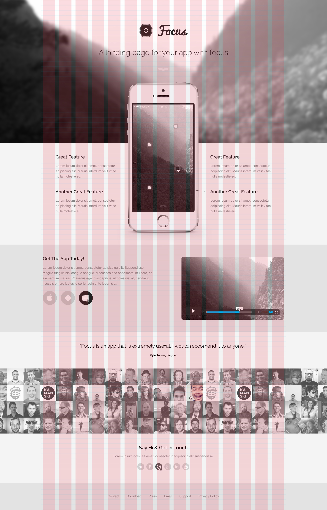

# Spring 2023 Foundations of Web Design and Development — Assignment 3 (HTML, CSS, and Beginner Sass)

* **Read these instructions repeatedly until you understand, then begin your project. If something is not clear, ask.**

## ❖・Before You Begin・❖

1. Log in to GitHub.
2. Fork this repo(sitory). See [this video](http://code-warrior.github.io/tutorials/git/github/forking-and-cloning-at-the-github-web-site/) on how to carry out this step and step `3`.
3. Clone your fork, using either the web site or the GitHub Desktop client.
4. Checkout your personalized branch, the one with your name and GitHub handle.

---

## ❖・Introduction・❖

This assignment is designed to get you to _a_) practice advanced HTML, _b_) author more advanced CSS, and _c_) to start working with Sass. You’ll do so by implementing a web page — pixel-by-pixel — of the follow mockup, which you’ll find in `comps/focus.jpg`.

---
## ❖・Due・❖

Monday, 10 April 2023, by 9:45 AM.

---

## ❖・Submission・❖

You will need to issue a pull request back into the original repo, the one from which your fork was created for this project. See the **Issuing Pull Requests** section of [this site](http://code-warrior.github.io/tutorials/git/github/index.html) for help on how to submit your assignment.

**Note**: This assignment may *only* be submitted via GitHub. **No other form of submission will be accepted**.
